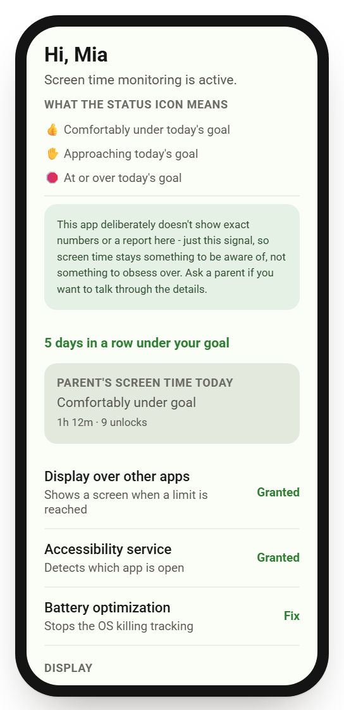
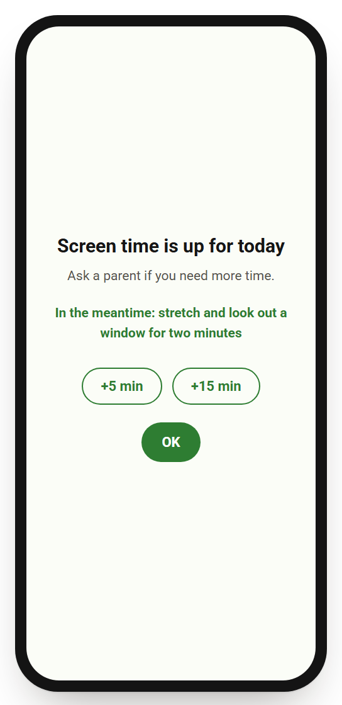
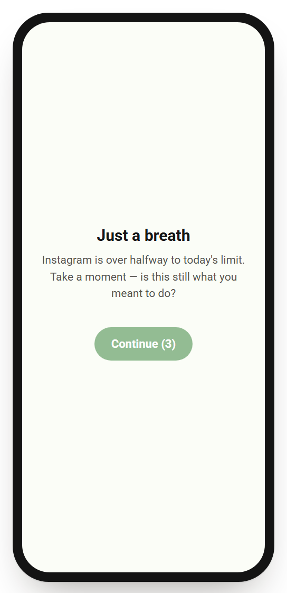
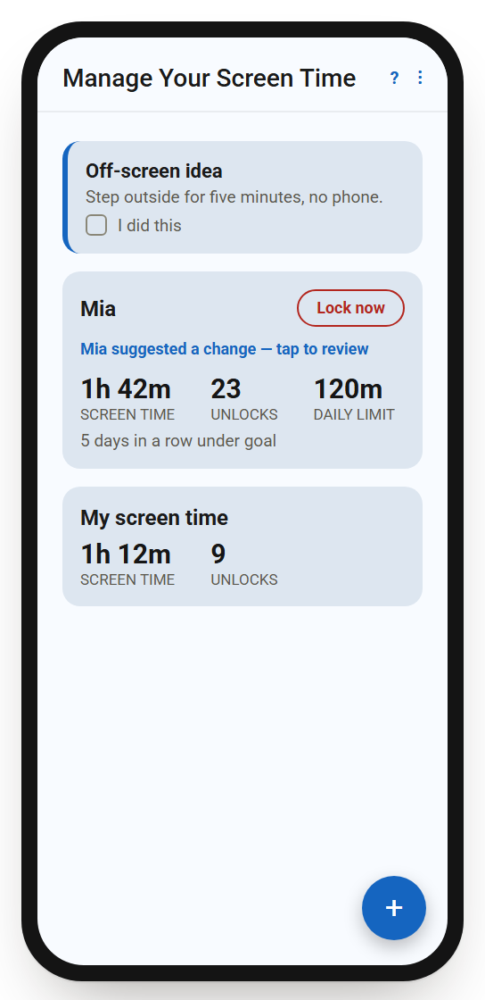
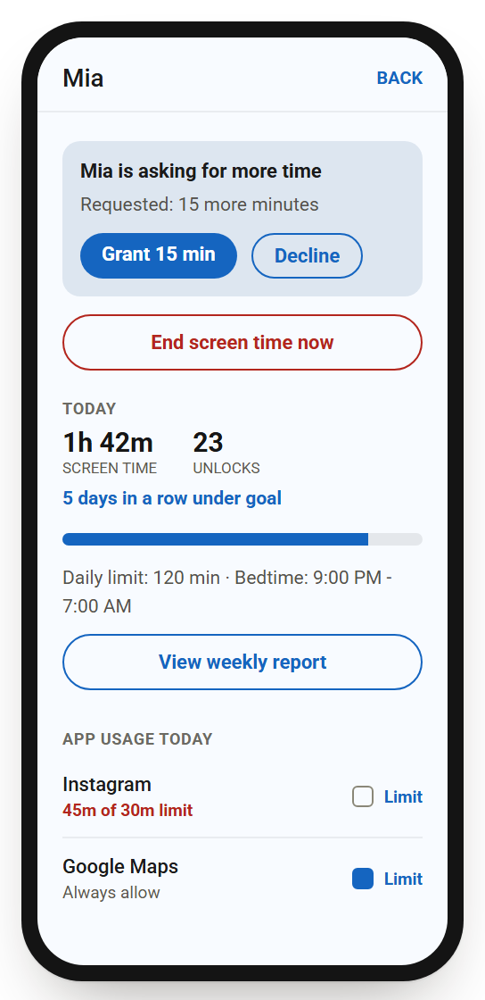
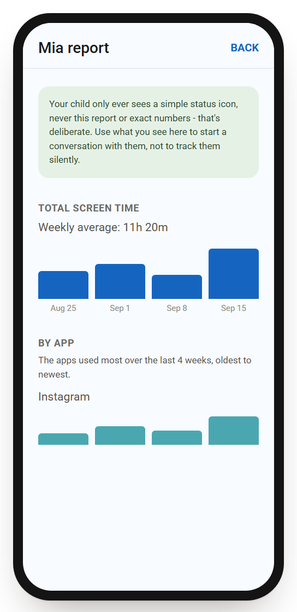

# OpenScreenTime

> **Beta.** Functional and real-device-tested on Android, but young: no security audit,
> limited device/OEM coverage, and two known gaps the community could pick up (see
> [What's missing](#whats-missing-and-could-use-a-contributor) below) - an iOS kid app and
> smartwatch tracking/limits.

OpenScreenTime is a free, open-source, no-nonsense screen time platform for families. The project is designed to work across Android and iOS, starting with a functional Android implementation for parents and kids.

No account fees, no ads, no dark patterns. MIT licensed — fork it, self-host
your own backend, send patches back.

Android pairing, screen-time tracking, limits, locking, and parent controls
are implemented and have been through multiple rounds of real-device testing
(see [Project status](#project-status)). The iOS app covers the *parent*
side only - see the iOS note below and [`ios/README.md`](ios/README.md).

**iOS note:** the iOS app is parent-only. There is no OpenScreenTime Kid for iPhone yet — Apple hasn't granted this project the Family Controls entitlement a kid-side app on iOS requires. A child must be paired using OpenScreenTime Kid on an Android phone; the iOS app can then manage that same child (and share access with another parent on Android or iOS), but can't pair or self-track on an iPhone itself. See [`ios/README.md`](ios/README.md) for details.

**Why OpenScreenTime?**

Most screen-time tools are built around subscriptions, engagement, and increasingly complex feature sets. OpenScreenTime takes a different approach: give parents a small set of useful controls, make the software transparent, and get out of the way.

The goal isn't to maximize time spent in an app. It's to help families use technology intentionally.

OpenScreenTime is MIT licensed so families and developers can inspect it, modify it, self-host it, and contribute improvements.

## Screens

[`design/screens.html`](design/screens.html) is a from-source reproduction of
every screen in both apps — real copy, real component states, pulled
directly from the Compose/SwiftUI source, not mockup placeholder text.
Open it in a browser to see the whole UI, including the "calm by design"
callouts explaining the reasoning behind specific choices. It's a faithful
rebuild, not photographs of a real device — if you're running this on your
own phone, real screenshots to replace it are a very welcome contribution.

| Kid: calm status | Kid: block screen | Kid: friction pause |
| :---: | :---: | :---: |
|  |  |  |

| Parent: dashboard | Parent: child detail | Parent: weekly report |
| :---: | :---: | :---: |
|  |  |  |

All 18 screens are in [`design/screenshots/`](design/screenshots/), rendered from
the gallery above.

## How it works

- **`kid`** — installed on the child's phone. Runs quietly in the background,
  measures screen time and unlocks, enforces the limits a parent has set, and
  syncs a daily summary to the cloud.
- **`parent`** — installed on the parent's phone. Shows live stats for each
  paired child, edits limits, and can opt into tracking the parent's *own*
  screen time the same way.
- **`shared`** — the data models, Firestore access code, and enforcement
  logic both apps use.
- **`ios`** — an iOS build of the parent app (Swift/SwiftUI), for a parent on
  an iPhone pairing with an Android kid device. See [`ios/README.md`](ios/README.md)
  for setup and current scope; there is no iOS kid app yet (see
  [issue #7](https://github.com/jsconu/OpenScreenTime/issues/7) and
  [What's missing](#whats-missing-and-could-use-a-contributor) below).

Sync between the two apps runs on [Firebase](https://firebase.google.com)
(Firestore + Authentication). There is no custom server to host — each
person running their own copy of this app points it at their own free
Firebase project.

**Multiple parents:** two parents (any mix of Android and iOS) see and
control the same child by signing into the same parent account
(email/password) on each of their own devices — nothing extra to set up.

```
parent app  <---sync--->  Firebase (Firestore + Auth)  <---sync--->  kid app
```

### What a parent can do

- Set a **daily time limit** and, per app, a **per-app time limit**.
- Set a **bedtime window** — a full block independent of the minute-count
  limit, with its own "wind down" copy on the block screen rather than an
  alternative-activity suggestion.
- Mark specific apps **"always allowed"** so they stay usable (a phone/calling
  app, maps) even once the daily limit or bedtime hits.
- Mark specific **phone numbers as always-allowed during bedtime** — every
  other call is screened and blocked (Android's call-screening/redirection
  roles, Android 10+), and texts from anyone else are muted rather than
  alerting, so the phone is never fully unreachable overnight but also isn't
  a distraction magnet.
- **Lock now / End screen time now** at any point, for any reason, undone
  with "Resume."
- Turn on **uninstall protection** (Android device-admin) so removing the
  kid app shows a warning first — a deterrent, not a hard block.
- Block specific **websites/domains** device-wide, in any browser, via a
  local DNS sinkhole.
- Approve or decline a kid's own **suggested limit change**, and a kid's
  **request for more time** when blocked (including during bedtime) — both
  need an actual parent tap, never self-granted.
- View a **rolling 4-week report** (total screen time and a by-app trend) —
  reached with one deliberate tap, not shown on the main dashboard, and
  capped to 4 weeks on purpose so it stays a tool for noticing a trend, not
  an archive to pore over. Opening it repeatedly in one day triggers its own
  "check in, not check up" prompt, the same friction-pause idea used on the
  kid side, turned back on the parent.
- Turn on optional **unlock tracking** (which app was opened first after each
  unlock) and **notification-count tracking** (overall and by app - counts
  only, never content), each per kid and for the parent's own device. Off by
  default, nothing is collected until a category is on, and each one adds to
  the weekly report plus a day-by-day digest. A parent can also choose to
  show today's count on the kid's phone, with a note that watching counts
  can make phone use feel more compulsive.
- Ask the built-in **help bot** (the "?" on the dashboard) how to use the app,
  why it's designed the way it is, or what public guidance says about
  reasonable screen-time limits for a given age - answers cite their sources
  (WHO, the Canadian 24-Hour Movement Guidelines, the AAP, the UK Chief
  Medical Officers). It's a small offline retriever over a curated knowledge
  base, not an AI model: nothing you type leaves the phone, and it says so
  plainly when it has no answer.
- Opt the **parent's own device** into the exact same tracking/limits a kid
  gets — reusing the same dashboard card, same stats, same lock button.

### What a kid sees and can do

- A **calm status icon** (comfortably under / approaching / at-or-over
  today's goal) instead of a running number — explained right there in the
  app, along with *why* only this signal is shown.
- A **non-punitive streak** that only ever counts up; there's no "you missed
  a day" state anywhere.
- A **friction pause** (a few quiet seconds, once per app per day) crossing
  halfway into a per-app limit — not a block, a beat to notice the automatic
  reach for the app.
- A block screen with a **concrete alternative activity** suggestion (except
  at bedtime) and a **request more time** option that a parent has to
  approve.
- **Suggest a change** to their own limit, no passcode needed — sent to a
  parent for approval, not applied directly.
- An optional, **local-only notification digest** (plain text, grouped by
  app) — nothing here is ever synced to a parent.
- The same **help bot** behind a "?" on their home screen, for how the app
  works and why.
- A passcode-gated **Parent controls** screen, for a parent to edit limits
  directly on the kid's device without needing their own phone in hand.
- **Never** the weekly report, exact usage numbers, or a by-app breakdown —
  that detail stays with the parent by design, meant to start a
  conversation rather than run silent surveillance.

### Pairing

1. In the parent app, tap "+" and name the child. This shows a 6-digit
   pairing code and creates a child profile in Firestore.
2. In the kid app, enter that code. The kid app signs in anonymously to
   Firebase and atomically claims the code, linking that device to the child
   profile. No child email or personal info is ever collected.

### Family passcode, "Parent controls," and locking

Set a passcode from the parent app (top bar -> Passcode). It does two things:

- It locks the parent app itself on next launch (a saved hash, checked
  locally - no extra network round trip).
- The same passcode can be entered on a paired kid device (Status screen ->
  "Parent controls") to unlock the same limit editors and lock button
  *locally on that device*, without needing the parent's phone in hand. The
  kid device verifies it against a hash synced from Firestore, entirely
  offline.

Either app can hit "Lock now" / "End screen time now" at any point to block
every app on the kid's device immediately, regardless of the daily limit -
useful for dinner, bedtime, or just needing quiet right now. "Resume" undoes
it. The kid app also posts a one-time notification when screen time or an
app is within 5 minutes of its limit, so a limit is rarely a total surprise.

From the same passcode-gated "Parent controls" screen, a parent can also turn
on "Uninstall protection" (Android's device-admin API) so that removing the
kid app first shows a warning to ask a parent. This is a deterrent, not a
hard block - Android doesn't let a plain (non-Device-Owner) device admin
actually veto uninstalling, only warn - so a kid who taps through the
warning can still remove it.

The same screen also has "Bedtime calls": during the bedtime window, only
phone numbers a parent has explicitly allowed (Android's call-screening and
call-redirection roles, Android 10+) can call or text through - everyone
else is blocked until bedtime ends, so the phone can still reach a parent
overnight. Texts are muted rather than fully blocked (opening the messaging
app directly can still show one) - true SMS blocking would require becoming
the phone's default messaging app, a much larger undertaking left out of
scope for now.

### What "screen time" means here

- **Screen time** = time spent unlocked and interactive, measured from
  `ACTION_USER_PRESENT` (unlock) to the next `ACTION_SCREEN_OFF`. Time spent
  sitting on the lock screen doesn't count.
- **Unlocks** = number of `ACTION_USER_PRESENT` broadcasts per day.
- **Per-app time** = attributed via an `AccessibilityService` watching
  foreground window changes — this is also how app and daily limits are
  enforced (a full-screen block is shown once a limit is hit).

Everything resets at local midnight on the kid's device.

## Project status

The Android apps (kid and parent) are functional and have been through
several rounds of real-device installation, pairing, and day-to-day use,
with bugs found that way fixed as they came up (see the closed issues for
specifics). That's still one household's worth of devices, not broad OEM
coverage — Samsung/Xiaomi/etc.-specific background-execution behavior in
particular is still an open question (see
[issue #5](https://github.com/jsconu/OpenScreenTime/issues/5)). There's also
been no independent security audit; review `firebase/firestore.rules`
yourself before trusting it with real family data. Treat it as a solid,
actively-used starting point, not a finished, broadly-verified product.

### What's missing (and could use a contributor)

Two things are explicitly out of scope for now, not because they're
undesirable, but because they're each roughly as much work as a whole
additional platform target — real community-contributor territory:

- **An iOS kid app.** Requires Apple's Family Controls entitlement, which
  this project hasn't been granted (see
  [issue #7](https://github.com/jsconu/OpenScreenTime/issues/7) for the
  requirements analysis). Someone with an active Apple Developer account and
  the patience for Apple's entitlement-request process could unblock this.
- **Smartwatch tracking/limits.** Technically feasible only for Wear OS (not
  Tizen, Fitbit, Garmin, or Apple Watch - none of those expose a third-party
  API for this at all), but it means a genuinely separate app: its own
  Wear Compose UI, its own on-watch AccessibilityService-based enforcement
  loop, its own sync layer back to the phone over Google's Wearable Data
  Layer API, and real physical watch hardware to test background-survival
  on, since watch battery/Doze constraints are stricter than a phone's.
  Worth doing if someone's motivated and has the hardware; not something to
  start without knowing that scope going in.

Smaller, more approachable gaps: weekly-report iOS parity (see
[`ios/README.md`](ios/README.md)), broader OEM background-survival testing
(#5), and a from-scratch security review of the Firestore rules (#2 covered
an initial pass, not a full audit).

## Building

You'll need [Android Studio](https://developer.android.com/studio)
(Ladybug or newer) with a JDK 17 and Android SDK 35.

1. **Create a Firebase project** at [console.firebase.google.com](https://console.firebase.google.com)
   (the free Spark plan is enough — no credit card required).
2. In the Firebase console, register **two** Android apps in that one
   project:
   - Package name `org.openscreentime.kid`
   - Package name `org.openscreentime.parent`
3. Download `google-services.json` (it will contain both apps) and copy the
   **same file** into both `kid/google-services.json` and
   `parent/google-services.json`. These are gitignored — never commit them.
4. In the Firebase console, enable **Authentication** providers:
   Email/Password (for parents) and Anonymous (for kid devices).
5. Enable **Firestore Database** (production mode), then publish the rules
   in [`firebase/firestore.rules`](firebase/firestore.rules) — either paste
   them into the console's Rules tab, or install the
   [Firebase CLI](https://firebase.google.com/docs/cli) and run
   `firebase deploy --only firestore:rules` from a directory containing a
   `firebase.json` pointing at that file.
6. Open the project root in Android Studio and let it sync. Run the `kid`
   configuration on one device/emulator and `parent` on another (or the
   same emulator with two profiles) to test pairing end-to-end.

> **Note on the Gradle wrapper:** this repo doesn't check in the
> `gradle-wrapper.jar` binary. Android Studio doesn't need it to sync or
> run the project. If you want to build from the command line, generate it
> once with `gradle wrapper --gradle-version 8.9` (requires a local Gradle
> install), after which `./gradlew` will work normally.

On the kid's device, after installing, the app will ask you to grant a few
things from its status screen: **Accessibility service**, **display over
other apps**, **notifications**, **battery optimization**, and the
**website filter**. Those are required for tracking and limit enforcement.
A few more are optional, granted separately, and not part of that core
checklist: a **calm notification list** (local-only digest), **notification
access** (also powers muting non-allowed texts during bedtime), and, from
the passcode-gated Parent controls screen, **uninstall protection** and
**bedtime call blocking** (Android 10+ only for the latter).

## Security & privacy notes for anyone deploying this

- The kid app never reads screen *content* — the accessibility service only
  observes which app's window is in front, nothing more
  (`canRetrieveWindowContent="false"`).
- Firestore security rules (`firebase/firestore.rules`) are written so a kid
  device can only ever read/write the one child record it claimed via
  pairing — never another family's data. Please review them yourself before
  relying on this for anything sensitive; this is a community project, not
  an audited product.
- This kind of app is inherently powerful (it can see app usage and block
  apps). Use it thoughtfully and talk to your kid about it — it's meant to
  support a conversation about healthy screen time, not to be sprung on
  someone unannounced. The detailed weekly report and by-app breakdown are
  deliberately parent-only and never reach the kid app, for the same reason.
- The optional bedtime-call-blocking and notification-access permissions are
  powerful too (they can screen calls and dismiss notifications) - both are
  opt-in, separate from the core tracking checklist, and only take effect
  during the configured bedtime window.
- All three apps report crashes to Firebase Crashlytics (same Firebase
  project as everything else): stack traces plus device model/OS/app
  version, never any family data. CI/emulator builds never report.

## Contributing

See [CONTRIBUTING.md](CONTRIBUTING.md). Issues and PRs welcome.

## License

MIT — see [LICENSE](LICENSE). Free forever, use it however you like.
